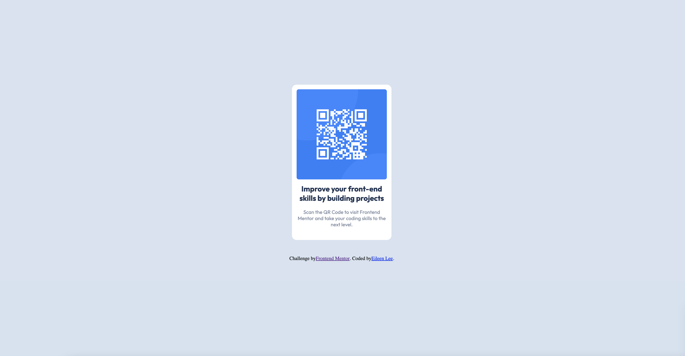

# Frontend Mentor - QR code component solution

This is a solution to the [QR code component challenge on Frontend Mentor](https://www.frontendmentor.io/challenges/qr-code-component-iux_sIO_H). Frontend Mentor challenges help you improve your coding skills by building realistic projects. 

## Table of contents

- [Overview](#overview)
  - [Screenshot](#screenshot)
  - [Links](#links)
- [My process](#my-process)
  - [Built with](#built-with)
  - [What I learned](#what-i-learned)
  - [Continued development](#continued-development)
  - [Useful resources](#useful-resources)
- [Author](#author)
- [Acknowledgments](#acknowledgments)

## Overview

A simple QR code component on desktop and mobile
This was done as an exercise in HTML/CSS.

### Screenshot

### Links

- Solution URL: [Add solution URL here](https://your-solution-url.com)
- Live Site URL: [Add live site URL here](https://your-live-site-url.com)

## My process

I replicated the suggested QR code component design for desktop and mobile using HTML and CSS. I referenced various tools and sites to complete the design and deployed it live through Github.

### Built with

- Semantic HTML5 markup
- CSS custom properties
- Flexbox
- CSS Grid
- Mobile-first workflow
- [Styled Components](https://styled-components.com/) - For styles

### What I learned

I learned how to link my website to external files. For example, linking my HTML to a CSS document, a favicon image, and open-source fonts and styles.

This was a great exercise in understanding and applying box properties, with padding and margin. I also learned about the flex-box property and aligned items inside a div container. This was trickier than I thought, and it gave me a good understanding of how images and containers function.

I also learned how to center components in a responsive website. Rather than assigning static properties, the image and container adjusts to varying desktop and mobile sizes.

### Continued development

In the future, I would like to work more with responsive screens, especially adjusting text and image sizes. I also want to utilize the flex-box property more often for more complicated visual designs in the future.

### Useful resources

- [W3 Schools CSS](https://www.w3schools.com/css/css3_flexbox.asp) - This helped me to understand CSS flex-box and its varying properties. I would like to use this more in the future.
- [Geeks for Geeks](https://www.geeksforgeeks.org/how-to-set-div-width-to-fit-content-using-css/) - This example code gave me a good idea of what my code should look like and how I should format my container to adjust for the image and text inside.

## Author

- Website - [Eileen Lee](https://eileenlee.me/)

## Acknowledgments

Shout out to Dr. Angela for pointing me towards this resource. I learned about FrontEnd Mentor through her course "The Complete 2023 Web Development Bootcamp".
